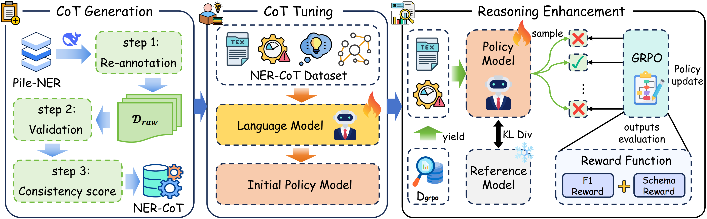
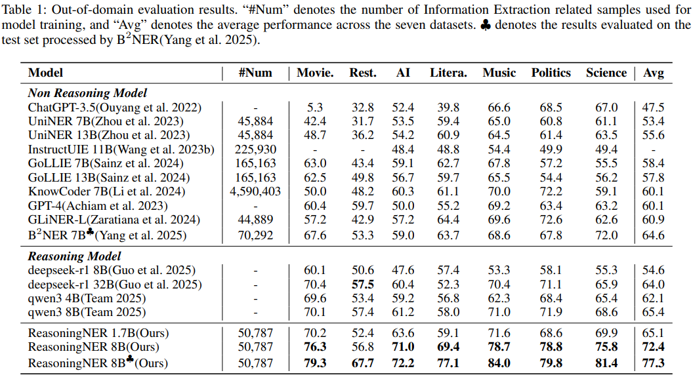

# ReasoningNER: A Reasoning Paradigm for Named Entity Recognition

This repository is the official implementation of the paper "**A Reasoning Paradigm for Named Entity Recognition (accepted by AAAI 2026)**".

In this project, we propose a novel reasoning paradigm for Named Entity Recognition (NER) that shifts the modeling
approach from traditional implicit pattern matching to an explicit, verifiable reasoning process.

Our model, **ReasoningNER**, is trained through three stages: **Chain-of-Thought (CoT) Generation**, **CoT Tuning**, and
**Reasoning Enhancement**.

Experiments show that this paradigm significantly improves the model's generalization ability and data efficiency in
zero-shot, few-shot, and cross-domain scenarios.

---

## Table of Contents

- [Model Architecture](#model-architecture)

- [Performance](#performance)

- [How to Use](#how-to-use)

- [Dataset Preparation](#dataset-preparation)

- [Stage 1: CoT Tuning (CT)](#stage-1-cot-tuning-ct)

- [Stage 2: Reasoning Enhancement (RE)](#stage-2-reasoning-enhancement-re)

## Model Architecture

The core idea of ReasoningNER is to inject explicit reasoning capabilities into Large Language Models (LLMs) through a
three-stage process.

1. **CoT Generation**: We first construct a high-quality NER-CoT dataset, where each entity annotation is accompanied by
   a detailed, step-by-step reasoning chain.

2. **CoT Tuning**: We use the NER-CoT dataset to perform Supervised Fine-Tuning (SFT) on a base language model, teaching
   it to generate a coherent reasoning process before predicting the final entities.

3. **Reasoning Enhancement**: After fine-tuning, we employ a reinforcement learning algorithm (GRPO) to further optimize
   the model's reasoning policy. Using a composite reward function (including F1 score and Schema compliance), we
   incentivize the model to generate more accurate and reliable reasoning paths.



## Performance



## How to Use

### Requirements

- torch

- transformers

- trl

- accelerate

- deepspeed

- flash attention

- liger-kernel

- vllm (0.9.1)

### Dataset Preparation

Before starting the training, please prepare the necessary datasets.

* **NER-CoT Dataset**: The complete dataset is available on Hugging Face at the following
  link: [https://huggingface.co/datasets/HuiHuang/NER-CoT](https://huggingface.co/datasets/HuiHuang/NER-CoT).

* **InstructUIE**: The InstructUIE dataset can be downloaded from the following
  address: [https://github.com/BeyonderXX/InstructUIE](https://github.com/BeyonderXX/InstructUIE?tab=readme-ov-file#data)

### Stage 1: CoT Tuning (CT)

This stage corresponds to Supervised Fine-Tuning. You can start the training by running the following script (`sft.py`):

```bash
accelerate launch \
    --config_file config/accelerate_config/deepspeed_zero3.yaml \
    sft.py \
    --config config/sft/qwen3-8b.yaml
```

### Stage 2: Reasoning Enhancement (RE)

After completing CoT tuning, use the RE script (`grpo.py`) to further optimize the model through reinforcement learning:

1. Sample from the InstructUIE dataset.

```bash
python sample_grpo.py \
  --base_path IE_INSTRUCTION/NER \
  --output_file data/grpo.json \
  --num_samples 5000 \
  --max_count 10000 \
  --shuffle
```

2. Deploy vLLM to accelerate GRPO training.

```bash
CUDA_VISIBLE_DEVICES=7 python -m trl.scripts.vllm_serve \
    --model outputs/qwen3-8b-sft \
    --tensor_parallel_size 1 \
    --data_parallel_size 1 \
    --port 5407 \
    --enable_prefix_caching
```

3. Start the GRPO training process.

```bash
CUDA_VISIBLE_DEVICES=0,1,2,3,4,5,6 accelerate launch \
    --config_file config/accelerate_config/deepspeed_zero3.yaml \
    --num_processes 7 \
    grpo.py \
    --config config/grpo/qwen3-8b.yaml
```

### Evaluation

```bash
python evaluate.py \
  --model outputs/qwen3-8b-grpo \
  --base_path IE_INSTRUCTION/NER \
  --result_file eval_result.json \
  --template qwen3
```
